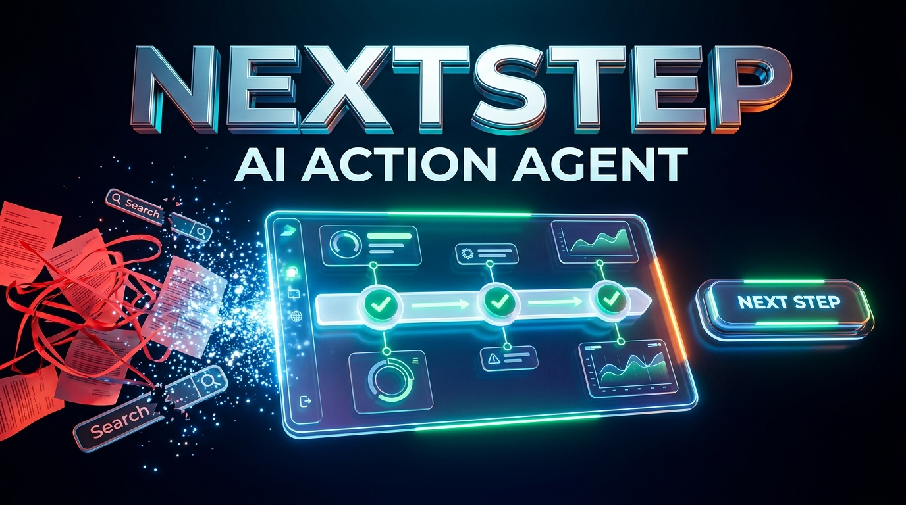

<div align="center">

# ⚡ NEXTSTEP
### *Universal AI Action Agent — From Problem to Done in Minutes*

[](https://ai.google.dev/)
[](https://serpapi.com/)
[](https://vitejs.dev/)
[](https://fastapi.tiangolo.com/)
[](https://www.sqlite.org/)

**Created by Saurav B**

*Don't search for how to do it. Just tell NEXTSTEP what you need to get done.*

[Live Demo](https://youtu.be/uayk2e85GjU?si=2EEDm8WJTh-l-Axq)     <--------------->      [Video Walkthrough](#-video-demo-script-245-min) 

---

</div>


## 📌 Executive Summary

Every year, millions of citizens, students, and consumers waste countless hours trapped in administrative bureaucracy:
- Which government department handles my issue?
- What exact documents are required for my state or city?
- Where do I file the application?
- How do I draft a legally sound representation or notice?
- What is my immediate next action?

**NEXTSTEP** fundamentally changes this by replacing passive search with an **Autonomous AI Action Agent**. Powered by **SerpApi** for real-time web intelligence and **Google Gemini** for reasoning and synthesis, NEXTSTEP cuts multi-day procedural headaches down to under **3 minutes** by providing an executable, location-aware action plan with auto-drafted correspondence and direct portal links.

---

## 🚀 Key Features

### 1. 💡 Real-Time "Did you mean?" Typing Suggestions
As the user begins typing, Gemini dynamically analyzes their keywords and presents 3 tailored procedural variations (e.g. *Duplicate Driving Licence*, *Report Lost Licence*, *Renew Expired Licence*) with 1-click execution.

### 2. 📍 Location & Jurisdiction Intelligence
Automatically resolves multi-tiered jurisdiction hierarchies (**Country ➔ State ➔ City ➔ Competent Authority**) anchored to regional bodies (default: *Thiruvananthapuram, Kerala*), ensuring users never follow rules meant for the wrong jurisdiction.

### 3. 🔍 Live SerpApi Research & Source Verification
Executes parallel multi-engine searches (Google Web, Google Maps) to retrieve the latest official rules, application deadlines, and fee structures. Every source is audited and ranked:
- 🟢 **Official** (Government and university portals)
- 🔵 **Trusted** (Established media and accredited legal resources)
- 🟡 **Supporting** (Community guides and secondary explainers)

### 4. 🎯 Dominant "YOUR NEXT STEP" Hero Card
Eliminates analysis paralysis by prominently featuring the exact single task required *right now*, complete with estimated timeline, prerequisites, and a direct link to the verified official portal.

### 5. 🗺️ Process Stage Progression Tracker & Action Map
- **Stage Pipeline**: Visual multi-step progression (*Prerequisites & Verification* ➔ *Application & Submission* ➔ *Administrative Processing* ➔ *Issuance & Fulfillment*).
- **Interactive Action Map**: Network graph illustrating goals, branch decisions, and final outcomes.

### 6. 🏛️ Fast Administrative Email Studio (CSMOP & RTS Act)
Generates legally structured, executive correspondence adhering to the **Central Secretariat Manual of Office Procedure (CSMOP)** and the **Kerala State Right to Service Act, 2012**:
- Formatted dispatch numbers, statutory turnaround timers, and verification clauses.
- **1-Click "Open in Gmail"**: Instantly launches Gmail Web with recipient, subject, and body pre-filled.
- **A4 Print / PDF View**: Clean, ink-efficient vector print styles without dark mode backgrounds.

### 7. 📜 Statutory Document Drafting
Produces ready-to-sign formal draft templates in seconds:
- Sworn affidavits on ₹200 Non-Judicial Stamp Paper format.
- Pre-litigation consumer notices under Section 35 of the Consumer Protection Act.
- Certified RTI applications under Section 6(1) of the RTI Act, 2005.

### 8. ⚡ Fast Path Engine
Users can check off documents they already hold (e.g. Aadhaar, FIR copy). The engine recalculates the shortest path, saving unnecessary steps and days of processing time.

### 9. 🧠 Stateful Process Memory Panel
Maintains case metadata (`applicant_name`, `reference_number`, `contact_phone`, `application_date`) in SQLite, auto-populating every drafted email and document. Supports custom fields (`+ Add Field`).

### 10. 🔄 Adaptive Replanner
When an authority responds with new requirements or pushback, users can paste the notice or SMS. The agent dynamically shifts the process stage and injects new remediation steps.

---

## 🏗️ Architecture

```text
               USER SITUATION / PROBLEM
                          ↓
      TaskComposer (Gemini "Did You Mean?" Suggestions)
                          ↓
        Contextual Questions (Minimal Countdown Engine)
                          ↓
        Jurisdiction Resolver (Thiruvananthapuram Anchor)
                          ↓
      SerpApi Planner (Parallel Google Web + Maps Queries)
                          ↓
      Source Analyzer (Ranked 🟢 Official / 🔵 Trusted)
                          ↓
      Gemini Process Generator (Stages, Steps, Action Map)
                          ↓
       STAGE-AWARE ACTION DASHBOARD
       ┌───────────────────┼───────────────────┐
       ↓                   ↓                   ↓
  "YOUR NEXT STEP"    Stage Pipeline      Process Memory
       ↓                   ↓                   ↓
  Official Portals    CSMOP Email        Statutory Docs
       ↓                   ↓                   ↓
           User Action / Authority Reply
                          ↓
            Adaptive Replanner Engine
                          ↓
             Process Dynamically Updated
```

---

## 🛠️ Technology Stack

| Layer | Technology | Purpose |
| :--- | :--- | :--- |
| **Search Intelligence** | [SerpApi](https://serpapi.com/) | Live verified Google Search & Maps queries with SQLite caching |
| **LLM & Reasoning** | [Google Gemini 2.5 Flash](https://ai.google.dev/) | Real-time intent parsing, dynamic suggestions, and action synthesis |
| **Backend API** | [FastAPI (Python 3.10+)](https://fastapi.tiangolo.com/) | High-performance asynchronous API endpoints with Pydantic v2 |
| **Database** | [SQLite3](https://www.sqlite.org/) | Persistent local storage for processes, steps, sources, and cache |
| **Frontend UI** | [React 19](https://react.dev/) + [Vite](https://vitejs.dev/) | Blazing fast client with modern typography and fluid micro-interactions |
| **Styling** | [Tailwind CSS](https://tailwindcss.com/) + CSS Grid | Dark-mode glassmorphic aesthetics and A4 print vector stylesheet |
| **Icons** | [Lucide React](https://lucide.dev/) | Clean, accessible iconography |

---

## ⚡ Quick Start

### Prerequisites
- Python 3.10+
- Node.js 18+
- SerpApi API Key ([Get one here](https://serpapi.com/))
- Google Gemini API Key ([Get one here](https://aistudio.google.com/))

### 1. Clone Repository
```bash
git clone https://github.com/Aurenox/nextstep-ai.git
cd nextstep-ai
```

### 2. Backend Setup
```bash
cd backend
python -m venv venv
# On Windows:
venv\Scripts\activate
# On macOS/Linux:
# source venv/bin/activate

pip install -r requirements.txt  # or install fastapi uvicorn google-genai requests pydantic
```

Configure your `.env` file inside `backend/`:
```env
SERPAPI_API_KEY=your_serpapi_api_key_here
GEMINI_API_KEY=your_gemini_api_key_here
PORT=8000
HOST=127.0.0.1
```

Run backend test suite:
```bash
python test_backend.py
```

Start the API server:
```bash
python -m uvicorn app.main:app --reload --port 8000
```
*API docs available at: `http://127.0.0.1:8000/docs`*

### 3. Frontend Setup
In a new terminal:
```bash
cd frontend
npm install
npm run dev
```
Open **`http://localhost:5173`** in your browser.

---

## 🎬 Video Demo Script (2:45 min)

A timed video demonstration script (`DEMO_SCRIPT.srt`) is included in the root directory for hackathon presentations and project demos:

| Timecode | Segment | Core Highlight |
| :---: | :--- | :--- |
| `00:00 - 00:25` | **Introduction & Problem Hook** | Saurav B introduces the frustration of public administration bureaucracy. |
| `00:25 - 00:52` | **Smart Issue Analysis & "Did You Mean?"** | Typing detection via Gemini with instantaneous procedural options. |
| `00:52 - 01:22` | **Live SerpApi Research & Transparency** | Parallel searches, verified 🟢 official sources, zero misinformation. |
| `01:22 - 01:52` | **Dominant Next Step & Action Map** | Focused single-step execution, stage pipeline, and visual route mapping. |
| `01:52 - 02:22` | **Fast Administrative Email & Legal Docs** | CSMOP-compliant drafts with 1-click "Open in Gmail" & sworn affidavits. |
| `02:22 - 02:35` | **Fast Path & Adaptive Replanner** | Document possession shortcuts and dynamic re-planning from authority replies. |
| `02:35 - 02:45` | **Conclusion & Call to Action** | Turning multi-day friction into minutes. |

---

## 👨‍💻 Author & Contact

* **Lead Developer**: **Saurav B**
* **Project**: **NEXTSTEP (AI Action Agent)**
* **GitHub**: [@Aurenox](https://github.com/Aurenox)
* **Repository**: [https://github.com/Aurenox/nextstep-ai](https://github.com/Aurenox/nextstep-ai)

---

## 📄 License

This project is licensed under the **MIT License** — feel free to use, modify, and build upon it.
